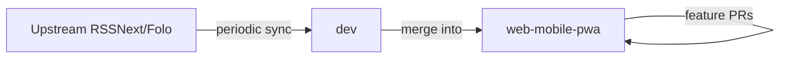

# Web Mobile & PWA Delivery Audit

> Resolves [#9](https://github.com/lhq1412/Folo/issues/9) · Parent [#1](https://github.com/lhq1412/Folo/issues/1)
>
> Audit date: 2026-08-03 (updated for branch strategy change)
>
> Audited branch: `web-mobile-pwa` (default branch)
>
> Upstream sync branch: `dev`

## Branch strategy

| Branch               | Role                                                                                                                           |
| -------------------- | ------------------------------------------------------------------------------------------------------------------------------ |
| **`web-mobile-pwa`** | **Default branch.** Primary integration target for mobile web and PWA work (#2–#8). All feature PRs merge here.                |
| **`dev`**            | **Upstream sync branch.** Tracks upstream (`RSSNext/Folo` or equivalent). Not the default integration target for PWA delivery. |

### Workflow

1. Pull upstream changes into `dev`.
2. Merge `dev` → `web-mobile-pwa` to stay current.
3. Land child issues #2–#8 as PRs targeting **`web-mobile-pwa`**.
4. Keep unrelated product changes in separate PRs with explicit scope (see below).

> **Note:** An earlier draft of this audit proposed replacing `web-mobile-pwa` with a scoped branch rebuilt from `dev`. That approach is **obsolete** now that `web-mobile-pwa` is the default branch. The file inventory and commit mapping below remain valid; the delivery strategy is **extract and track**, not **replace the integration branch**.

## Executive summary

`web-mobile-pwa` changed **114 files** relative to the fork point on `dev` (+1,226 / −2,866 lines). Only **34 files** are required for mobile web and PWA delivery; **80 files** are unrelated (analytics/tracker removal, Sentry, native mobile edits, Docker/devcontainer, etc.).

Because `web-mobile-pwa` is already the default branch and contains the mixed history, issue #9 delivers:

1. A complete file/commit inventory (below).
2. A PR split plan for **future** work targeting `web-mobile-pwa`.
3. Identification of unrelated commits already on the default branch that should not be bundled with new PWA PRs.

## Recommended delivery order

All items below merge into **`web-mobile-pwa`** unless noted.

| Order | Work unit                              | Child issue    | Depends on                 | Rollback boundary                                           |
| ----: | -------------------------------------- | -------------- | -------------------------- | ----------------------------------------------------------- |
|     1 | Service Worker precache & update fixes | #2             | current `web-mobile-pwa`   | Revert SW changes; PWA install may fail but web still loads |
|     2 | Cloudflare CORS hardening              | #4             | deployment files on branch | Revert `cloudflare/snippet.js` CORS logic only              |
|     3 | Production PWA & mobile E2E            | #3             | #2                         | Revert Playwright project additions                         |
|     4 | Viewport, keyboard, zoom               | #5             | current `web-mobile-pwa`   | Revert CSS/viewport meta only                               |
|     5 | Subscription drawer a11y               | #6             | #5                         | Revert drawer ARIA/focus changes                            |
|     6 | Install & update UX                    | #7             | #2, #3                     | Revert prompt components                                    |
|     7 | Offline cache policy                   | #8             | #2, #3                     | Revert SW runtime routes                                    |
|     8 | Dev environment (Docker/devcontainer)  | separate issue | none                       | Independent; no product impact                              |
|     9 | Analytics/tracker removal              | separate issue | none                       | Independent; requires product sign-off                      |
|    10 | Sentry removal (SSR)                   | separate issue | none                       | Independent; requires ops sign-off                          |

Child issues #2–#8 should branch from and merge back to **`web-mobile-pwa`**.

## Commits already on `web-mobile-pwa`

| Commit      | Message                                                          | Category               | PWA-related? |
| ----------- | ---------------------------------------------------------------- | ---------------------- | :----------: |
| `954eeed0f` | feat(web): improve mobile web layout and subscription drawer     | Mobile layout + drawer |      ✅      |
| `a4e414dd7` | feat(web): add PWA manifest, service worker, and install prompts | PWA + install UX       |      ✅      |
| `44f64ff67` | chore: add Cloudflare Pages deployment                           | Cloudflare deploy      |      ✅      |
| `9e33497b2` | fix: correct Cloudflare Pages build command                      | Cloudflare deploy      |      ✅      |
| `5f7c64ee2` | fix: pin Node 22 for Cloudflare builds                           | Cloudflare deploy      |      ✅      |
| `a7715930f` | fix: deploy static web via Workers instead of Pages CLI          | Cloudflare deploy      |      ✅      |
| `e71e43b10` | fix: remove _redirects conflicting with Workers SPA              | Cloudflare deploy      |      ✅      |
| `e7678ad78` | chore: remove GitHub Actions deploy workflow                     | Cloudflare deploy      |      ✅      |
| `3825e41a1` | chore: add Docker and devcontainer                               | Dev environment        |      ❌      |
| `e4ee1162e` | chore: ignore local pnpm store directory                         | Dev environment        |      ❌      |
| `b35b75959` | chore: remove PostHog analytics integration                      | Analytics removal      |      ❌      |
| `6cd6d6c57` | chore: remove Firebase/GA4 analytics and tracker adapters        | Analytics removal      |      ❌      |
| `2147f751b` | chore: disable tracker telemetry and remove Sentry               | Analytics + Sentry     |      ❌      |
| `e09f34b8b` | chore: remove @follow/tracker usage and ImpressionTracker        | Analytics removal      |      ❌      |
| `b0d447ac3` | chore: remove unused @follow/tracker package                     | Analytics removal      |      ❌      |
| `bcf5f261b` | fix(web): use ReturnType for setTimeout id                       | Incidental type fix    |      ❌      |
| `64cfa4604` | chore: merge dev into web-mobile-pwa                             | Upstream sync          |     N/A      |

### Handling unrelated commits already merged

These commits are **already on the default branch**. Issue #9 does not require reverting them immediately. Instead:

- **Do not** include further unrelated edits in PWA PRs (#2–#8).
- **Do** track them as separate delivery units (proposed follow-up issues A–C below).
- **Optional later:** revert unrelated commits on a dedicated branch if product/ops wants a cleaner history before upstream contribution via `dev`.

## File inventory

Relationship key: **required** = mobile/PWA goal; **supporting** = deploy/test; **independent** = valid but wrong unit; **unrelated** = no PWA justification.

Comparison baseline: fork point between `dev` and `web-mobile-pwa` (pre-PWA work).

| File or directory                                                                                  | Category              | Required for mobile/PWA | Proposed PR | Notes                                     |
| -------------------------------------------------------------------------------------------------- | --------------------- | ----------------------: | ----------- | ----------------------------------------- |
| `.node-version`                                                                                    | Cloudflare deployment |              supporting | #4          | Node pin for Cloudflare builds            |
| `apps/desktop/.env.example`                                                                        | Cloudflare deployment |              supporting | #4          | Web URL env docs                          |
| `apps/desktop/layer/renderer/index.html`                                                           | PWA + mobile viewport |                required | #2, #5      | Status bar style; viewport zoom fix in #5 |
| `apps/desktop/layer/renderer/public/_headers`                                                      | Cloudflare deployment |              supporting | #4          | Cache headers for SW/manifest             |
| `apps/desktop/layer/renderer/src/components/common/MobileSubscriptionDrawerBackdrop.tsx`           | Mobile drawer         |                required | #6          | Drawer overlay                            |
| `apps/desktop/layer/renderer/src/components/common/PWAInstallPrompt.tsx`                           | Install UX            |                required | #7          | Chromium `beforeinstallprompt`            |
| `apps/desktop/layer/renderer/src/hooks/biz/useNavigateEntry.ts`                                    | Mobile navigation     |                required | #5          | Closes drawer on navigation               |
| `apps/desktop/layer/renderer/src/initialize/index.ts`                                              | Mobile layout         |                required | #5          | Imports `mobile-layout.ts`                |
| `apps/desktop/layer/renderer/src/initialize/mobile-layout.ts`                                      | Mobile layout         |                required | #5          | Viewport resize sync                      |
| `apps/desktop/layer/renderer/src/lib/mobile-sidebar.ts`                                            | Mobile drawer         |                required | #6          | Drawer state                              |
| `apps/desktop/layer/renderer/src/modules/app-layout/MainDestopLayout.tsx`                          | Mobile layout         |                required | #5          | Safe-area top padding                     |
| `apps/desktop/layer/renderer/src/modules/app-layout/ai-enhanced-timeline/MobileTimelineLayout.tsx` | Mobile layout         |                required | #5          | List/detail single-screen                 |
| `apps/desktop/layer/renderer/src/modules/app-layout/subscription-column/SubscriptionColumn.tsx`    | Mobile drawer         |                required | #6          | Drawer wiring                             |
| `apps/desktop/layer/renderer/src/modules/command/commands/layout.tsx`                              | Mobile navigation     |                required | #6          | Toggle drawer command                     |
| `apps/desktop/layer/renderer/src/modules/entry-column/layouts/EntryListHeader.tsx`                 | Mobile navigation     |                required | #5          | Back button + header                      |
| `apps/desktop/layer/renderer/src/modules/subscription-column/SubscriptionColumnHeader.tsx`         | Mobile drawer         |                required | #6          | Drawer trigger                            |
| `apps/desktop/layer/renderer/src/modules/subscription-column/index.tsx`                            | Mobile layout         |                required | #5          | Layout re-export                          |
| `apps/desktop/layer/renderer/src/pages/(main)/layout.tsx`                                          | Mobile layout         |                required | #5          | Removes `<768px` download gate            |
| `apps/desktop/layer/renderer/src/providers/lazy/index.electron.ts`                                 | Install UX            |                required | #7          | No-op in Electron                         |
| `apps/desktop/layer/renderer/src/providers/lazy/index.ts`                                          | Install UX            |                required | #7          | PWA + iOS prompts                         |
| `apps/desktop/layer/renderer/src/providers/root-providers.tsx`                                     | Install UX            |                required | #7          | Mounts prompts                            |
| `apps/desktop/layer/renderer/src/styles/base.css`                                                  | Mobile layout         |                required | #5          | `100svh` mobile/standalone                |
| `apps/desktop/layer/renderer/src/workers/sw/index.ts`                                              | Service Worker        |                required | #2, #8      | Precache + nav fallback                   |
| `apps/desktop/package.json`                                                                        | Cloudflare deployment |              supporting | #4          | `deploy:web` script                       |
| `apps/desktop/tailwind.config.ts`                                                                  | Mobile layout         |                required | #5          | Breakpoint utilities                      |
| `apps/desktop/vite.config.ts`                                                                      | PWA                   |                required | #2          | `injectManifest`; fix in #2               |
| `apps/desktop/wrangler.personal.jsonc`                                                             | Cloudflare deployment |              supporting | #4          | Workers deploy config                     |
| `cloudflare/api/wrangler.toml`                                                                     | Cloudflare deployment |              supporting | #4          | API worker config                         |
| `cloudflare/pages.env.example`                                                                     | Cloudflare deployment |              supporting | #4          | Deploy env template                       |
| `cloudflare/snippet.js`                                                                            | Cloudflare + security |              supporting | #4          | CORS hardening in #4                      |
| `locales/app/en.json`                                                                              | Install UX            |                required | #7          | PWA install strings                       |
| `locales/app/ja.json`                                                                              | Install UX            |                required | #7          | PWA install strings                       |
| `locales/app/zh-CN.json`                                                                           | Install UX            |                required | #7          | PWA install strings                       |
| `package.json`                                                                                     | Cloudflare deployment |              supporting | #4          | Root deploy script                        |
| `.devcontainer/devcontainer.json`                                                                  | Dev environment       |               unrelated | separate    | Local dev only                            |
| `Dockerfile`                                                                                       | Dev environment       |               unrelated | separate    | Local dev only                            |
| `.gitignore`                                                                                       | Dev environment       |               unrelated | separate    | `.pnpm-store` ignore                      |
| `apps/desktop/layer/main/src/manager/bootstrap.ts`                                                 | Analytics removal     |               unrelated | separate    | PostHog session replay                    |
| `apps/desktop/layer/renderer/package.json`                                                         | Analytics removal     |               unrelated | separate    | Drops `@follow/tracker`                   |
| `apps/desktop/layer/renderer/src/App.tsx`                                                          | Analytics removal     |               unrelated | separate    | Removes `ImpressionTracker`               |
| `apps/desktop/layer/renderer/src/components/common/ErrorBoundary.tsx`                              | Sentry removal        |               unrelated | separate    | Removes Sentry                            |
| `apps/desktop/layer/renderer/src/components/common/ErrorElement.tsx`                               | Sentry removal        |               unrelated | separate    | Removes Sentry                            |
| `apps/desktop/layer/renderer/src/components/common/ImpressionTracker.tsx`                          | Analytics removal     |               unrelated | separate    | Deleted component                         |
| `apps/desktop/layer/renderer/src/components/ui/markdown/renderers/BlockErrorBoundary.tsx`          | Sentry removal        |               unrelated | separate    | Removes Sentry                            |
| `apps/desktop/layer/renderer/src/initialize/analytics.ts`                                          | Analytics removal     |               unrelated | separate    | GA4/Firebase removed                      |
| `apps/desktop/layer/renderer/src/initialize/helper.ts`                                             | Sentry removal        |               unrelated | separate    | Sentry init removed                       |
| `apps/desktop/layer/renderer/src/lib/ga4.ts`                                                       | Analytics removal     |               unrelated | separate    | Deleted                                   |
| `apps/desktop/layer/renderer/src/modules/ai-chat/**` (3 files)                                     | Analytics removal     |               unrelated | separate    | Tracker calls removed                     |
| `apps/desktop/layer/renderer/src/modules/ai-onboarding/**` (2 files)                               | Analytics removal     |               unrelated | separate    | Tracker calls removed                     |
| `apps/desktop/layer/renderer/src/modules/command/commands/integration.tsx`                         | Analytics removal     |               unrelated | separate    | Tracker calls removed                     |
| `apps/desktop/layer/renderer/src/modules/discover/FeedForm.tsx`                                    | Analytics removal     |               unrelated | separate    | Tracker calls removed                     |
| `apps/desktop/layer/renderer/src/modules/discover/ListForm.tsx`                                    | Analytics removal     |               unrelated | separate    | Tracker calls removed                     |
| `apps/desktop/layer/renderer/src/modules/entry-content/hooks.tsx`                                  | Analytics removal     |               unrelated | separate    | Tracker calls removed                     |
| `apps/desktop/layer/renderer/src/modules/integration/custom-integration-manager.ts`                | Analytics removal     |               unrelated | separate    | Tracker calls removed                     |
| `apps/desktop/layer/renderer/src/modules/new-user-guide/ai-chat-pane.tsx`                          | Analytics removal     |               unrelated | separate    | Tracker calls removed                     |
| `apps/desktop/layer/renderer/src/modules/panel/cmdk.tsx`                                           | Analytics removal     |               unrelated | separate    | Tracker calls removed                     |
| `apps/desktop/layer/renderer/src/modules/panel/cmdn.tsx`                                           | Analytics removal     |               unrelated | separate    | Tracker calls removed                     |
| `apps/desktop/layer/renderer/src/modules/player/corner-player.tsx`                                 | Analytics removal     |               unrelated | separate    | Tracker calls removed                     |
| `apps/desktop/layer/renderer/src/modules/review-prompt/provider.tsx`                               | Analytics removal     |               unrelated | separate    | `app-events` replacement                  |
| `apps/desktop/layer/renderer/src/modules/review-prompt/utils.ts`                                   | Analytics removal     |               unrelated | separate    | Tracker events removed                    |
| `apps/desktop/layer/renderer/src/modules/settings/helper/sync-queue.*`                             | Analytics removal     |               unrelated | separate    | Tracker calls removed                     |
| `apps/desktop/layer/renderer/src/modules/update-notice/UpdateNotice.tsx`                           | Analytics removal     |               unrelated | separate    | Tracker calls removed                     |
| `apps/desktop/layer/renderer/src/queries/auth.ts`                                                  | Analytics removal     |               unrelated | separate    | Login tracking removed                    |
| `apps/desktop/layer/renderer/src/queries/feed.ts`                                                  | Analytics removal     |               unrelated | separate    | Subscribe tracking removed                |
| `apps/desktop/layer/renderer/src/modules/ai-chat/.../UserRichTextMessage.tsx`                      | Incidental fix        |             independent | separate    | `ReturnType<typeof setTimeout>`           |
| `apps/mobile/**` (15 files)                                                                        | Analytics / native    |               unrelated | separate    | Tracker side effects                      |
| `apps/ssr/**` (6 files)                                                                            | Sentry + analytics    |               unrelated | separate    | SSR tracking + Sentry                     |
| `packages/internal/shared/src/app-events.ts`                                                       | Analytics removal     |               unrelated | separate    | Review-prompt event bus                   |
| `packages/internal/shared/src/env.*.ts` (4 files)                                                  | Analytics removal     |               unrelated | separate    | Analytics env vars removed                |
| `packages/internal/store/**` (3 files)                                                             | Analytics removal     |               unrelated | separate    | Tracker hooks removed                     |
| `packages/internal/tracker/**` (entire package)                                                    | Analytics removal     |               unrelated | separate    | Package deleted                           |
| `pnpm-lock.yaml`                                                                                   | Lockfile              |              supporting | per PR      | ~1,400 lines from tracker removal         |

## Risky cross-cutting changes

| Risk                                       | Files                                         | Mitigation                                                  |
| ------------------------------------------ | --------------------------------------------- | ----------------------------------------------------------- |
| Tracker removal breaks review-prompt       | `review-prompt/provider.tsx`, `app-events.ts` | Already on default branch; add tests before further changes |
| Sentry removal hides SSR errors            | `apps/ssr/client/initialize/sentry.ts`        | Ops sign-off; separate tracking issue                       |
| `injectManifest.injectionPoint: undefined` | `vite.config.ts`, `sw/index.ts`               | Fix in #2                                                   |
| Cloudflare proxy reflects any Origin       | `cloudflare/snippet.js`                       | Harden in #4                                                |
| Download page removed for `<768px`         | `pages/(main)/layout.tsx`                     | Intentional for mobile web                                  |
| Dual install prompts                       | `PWAInstallPrompt.tsx`, `lazy/index.ts`       | Unify in #7                                                 |

## Test commands per delivery unit

| Delivery unit                        | Commands                                                                         |
| ------------------------------------ | -------------------------------------------------------------------------------- |
| PWA foundation (on `web-mobile-pwa`) | `pnpm run typecheck` · `pnpm run lint` · `cd apps/desktop && pnpm run build:web` |
| Service Worker (#2)                  | above + inspect `out/web/sw.js` for `__WB_MANIFEST`                              |
| Cloudflare (#4)                      | `pnpm run build:web` · verify `_headers` on `sw.js`                              |
| Mobile E2E (#3)                      | Playwright mobile-chromium project (to be added)                                 |
| Viewport (#5)                        | iPhone viewport + manual iOS Safari                                              |
| Drawer A11y (#6)                     | Keyboard nav + axe                                                               |
| Install UX (#7)                      | Chromium install + iOS Add to Home Screen                                        |
| Offline (#8)                         | Playwright offline refresh tests                                                 |
| Upstream sync                        | `git checkout dev && git pull` · `git checkout web-mobile-pwa && git merge dev`  |

## Proposed follow-up issues

### A. Docker and devcontainer

- **Commits:** `3825e41a1`, `e4ee1162e`
- **Target:** separate PR (can target `dev` if upstreaming dev tooling, or stay documented on `web-mobile-pwa`)

### B. Analytics and `@follow/tracker` removal

- **Commits:** `b35b75959`, `6cd6d6c57`, `e09f34b8b`, `b0d447ac3`
- **Status:** already on `web-mobile-pwa`; track separately for review/upstream

### C. Sentry removal

- **Commits:** `2147f751b` (Sentry portions)
- **Status:** already on `web-mobile-pwa`; requires ops sign-off

## Next steps

1. Merge this audit into **`web-mobile-pwa`**.
2. Retarget [#11](https://github.com/lhq1412/Folo/pull/11) (or successor PR) to base **`web-mobile-pwa`**.
3. Branch child issues #2–#8 from **`web-mobile-pwa`**, not `dev`.
4. Sync upstream via `dev` → `web-mobile-pwa` merges on a regular cadence.
5. Create follow-up issues A–C for unrelated work already on the default branch.
6. Proceed to #2 (Service Worker precache injection fix).
